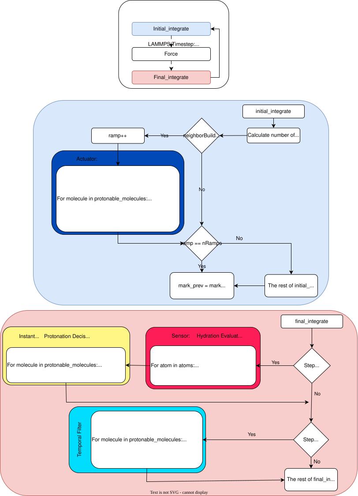

----------------------------------------------------------------------

Constant-pH Molecular Dynamics Extension for LAMMPS
----------------------------------------------------------------------

Contributing author:  Mahdi Tavakol

Affiliation:          University of Oxford

Contact:              mahditavakol90@gmail.com

----------------------------------------------------------------------

OVERVIEW
----------------------------------------------------------------------

This extension adds a complete framework for performing constant-pH
molecular dynamics (CpHMD) simulations within LAMMPS using λ-dynamics
and adaptive charge interpolation.

The method enables on-the-fly protonation and deprotonation of
molecules or residues, while maintaining global charge neutrality
through an optional buffer region.

The implementation extends the standard LAMMPS integrators (NVT, NPT,
and NH) to include additional λ degrees of freedom that evolve
dynamically alongside atomic coordinates. Thermostatting of λ
variables can be performed via Andersen, Bussi, or Nose–Hoover
schemes. When buffer particles are enabled, an additional total-charge
constraint enforces electroneutrality.

The constant-pH package is fully parallelized, compatible with LAMMPS’s
domain decomposition, and interoperable with all standard LAMMPS pair,
bond, angle, dihedral, and k-space styles.

----------------------------------------------------------------------

DIRECTORY STRUCTURE
----------------------------------------------------------------------

All new source files are contained in the following directory:

  src/CONSTANT_PH/

----------------------------------------------------------------------

FILES AND PURPOSE
----------------------------------------------------------------------

constant_pH_structures.cpp / .h
  - Reads, stores, and broadcasts charge templates for protonated and
    deprotonated states.
  - Provides lookup tables for each protonable group or molecule.

fix_constant_pH.cpp / .h
  - Core fix that manages λ variables, interpolates charges between
    protonation states, applies bias potentials, updates λ accelerations,
    and writes output for λ trajectories.
  - Interfaces with adaptive protonation and free-energy correction
    modules.

fix_adaptive_protonation.cpp / .h
  - Dynamically detects solvent exposure or environment changes.
  - Updates the list of protonable molecules during a simulation run.

fix_nh_constant_pH.cpp / .h
  - Nose–Hoover-style λ integrator.
  - Supports Andersen, Bussi, and Nose–Hoover thermostats for λ degrees
    of freedom.
  - Includes optional total-charge constraint coupling to the buffer.

fix_nvt_constant_pH.cpp / .h
  - NVT ensemble version that adds a dedicated temperature compute
    for the λ subsystem.

fix_npt_constant_pH.cpp / .h
  - NPT ensemble version coupling λ-dynamics to a barostat and
    pressure compute.

compute_temp_constant_pH.cpp / .h
  - Computes temperature including λ kinetic energy contributions.

compute_GFF_constant_pH.cpp / .h
  - Evaluates generalized free-energy corrections (ΔG_FF) using
    finite-difference sampling of H(λ ± δ).

----------------------------------------------------------------------

FIX_ADAPTIVE_PROTONATION UML
----------------------------------------------------------------------

----------------------------------------------------------------------

MODIFIED CORE FILES
----------------------------------------------------------------------

fix_nh.cpp / .h
  - Lightly modified Nose–Hoover integrator exposing internal hooks for
    λ-coupling and multi-thermostat support.
  - All changes are backward-compatible with standard LAMMPS behavior.

----------------------------------------------------------------------

NOTES
----------------------------------------------------------------------

- This package is designed for modular integration: all new code resides
  in the CONSTANT_PH directory, minimizing interference with other
  packages.
- The framework supports adaptive protonation, multi-site λ coupling,
  and on-the-fly free-energy corrections.
- Parallel consistency is maintained through careful use of
  per-atom storage, MPI reductions, and synchronization routines.

----------------------------------------------------------------------

BUILDING
----------------------------------------------------------------------

Enable the package when configuring LAMMPS with CMake:

  cmake -C ../cmake/presets/most.cmake \
        -D PKG_CONSTANT_PH=on \
        ../cmake
  cmake --build . --parallel

----------------------------------------------------------------------

REFERENCE
----------------------------------------------------------------------

If you use this extension, please cite:

  M. Tavakol, "Constant-pH Molecular Dynamics Framework for LAMMPS",
  University of Oxford (2025).  [In preparation]

----------------------------------------------------------------------

